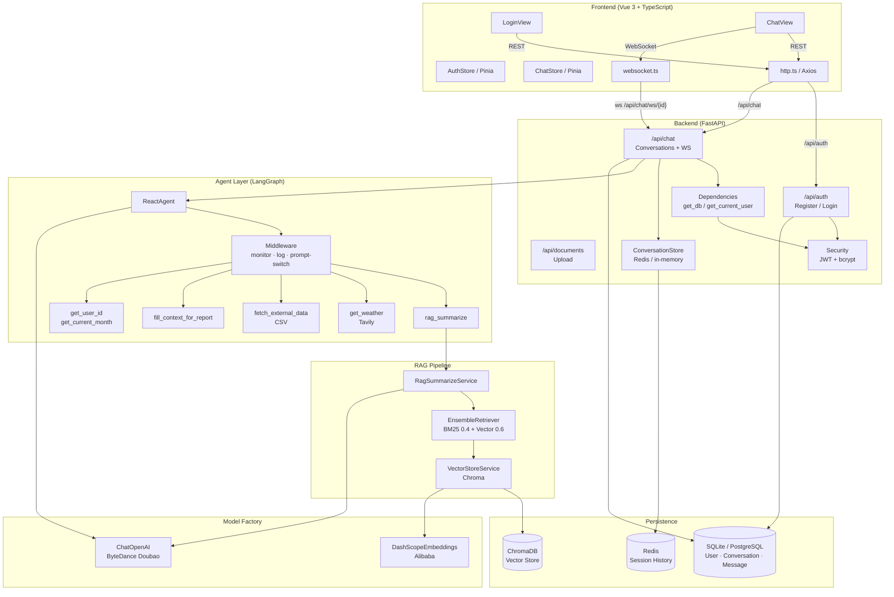

# Architecture Overview — 智扫通智能客服

## High-Level Diagram



---

## Layer Breakdown

### Frontend

| File | Role |
|---|---|
| `views/LoginView.vue` | Login + register tabs; auto-logs in and redirects to `/` after registration |
| `views/ChatView.vue` | Three-column layout: sidebar (conversations), message list, input bar |
| `stores/auth.ts` | JWT token + username persisted in `localStorage` |
| `stores/chat.ts` | Conversation list, current messages, streaming append helpers |
| `api/http.ts` | Axios instance; attaches `Bearer` token; on 401/403 (outside `/auth/login`) clears session and redirects to `/login` |
| `api/websocket.ts` | Wraps native WebSocket; dispatches `onChunk` / `onEnd` / `onError` callbacks |
| `router/index.ts` | Guards unauthenticated users away from `/`; redirects authenticated users away from `/login` |

### Backend API (FastAPI)

| Route | Endpoints | Notes |
|---|---|---|
| `/api/auth` | `POST /register`, `POST /login` | bcrypt passwords; returns JWT |
| `/api/chat` | `WS /ws/{conv_id}`, conversations CRUD | WebSocket streams chunks + `__END__` marker |
| `/api/documents` | `POST /upload` | Saves `.txt`/`.pdf` to `data/`; triggers a vector store rebuild on next query |
| `/api/health` | `GET /health` | Liveness probe |

**Core utilities:**

- `core/security.py` — `hash_password`, `verify_password`, `create_access_token`, `decode_token` (HS256 JWT)
- `core/dependencies.py` — `get_db` (SQLAlchemy session) and `get_current_user` (JWT → User lookup)
- `core/session.py` — `ConversationStore` wrapping Redis with a dict fallback for local dev

### Agent Layer (LangGraph / LangChain)

`ReactAgent` is instantiated per WebSocket connection (user-scoped). It:

1. Builds a message list from Redis history + the new user query.
2. Calls `agent.stream(messages, stream_mode="messages")`.
3. Yields text chunks back to the WebSocket handler.

**Middleware hooks** run around every tool call and model invocation:

| Hook | What it does |
|---|---|
| `monitor_tool` | Wraps tool execution with 3-attempt retry + exponential back-off; logs latency |
| `log_before_model` | Logs message count and estimated token usage before each LLM call |
| `report_prompt_switch` | Swaps in a report-specific system prompt when `context["report"]` is set |

**Available tools:**

| Tool | Description |
|---|---|
| `rag_summarize` | Hybrid retrieval (BM25 + vector) over the knowledge base |
| `get_weather` | Real-time weather via Tavily search API |
| `get_user_id` | Returns the authenticated user's ID (injected at construction time) |
| `get_current_month` | Returns `YYYY-MM` |
| `fetch_external_data` | Loads usage records from a CSV file (cached after first read) |
| `fill_context_for_report` | Sets the `report` context flag, triggering prompt switch |

### RAG Pipeline

```
User query
  └─► EnsembleRetriever
        ├─ BM25Retriever   (weight 0.4) — lexical match
        └─ VectorRetriever (weight 0.6) — semantic match (Chroma + DashScope)
  └─► Top-k documents formatted as [参考资料N]: ...
  └─► Prompt template | Doubao LLM | StrOutputParser
  └─► Summarised answer returned to agent
```

Document ingestion uses MD5 hashing to skip already-indexed files.

### Model Factory

Both singletons are created once at module import and shared across all requests:

```python
chat_model  = ChatModelFactory().generator()   # ByteDance Doubao via OpenAI SDK
embed_model = EmbeddingsFactory().generator()  # Alibaba DashScope
```

### Persistence

| Store | Technology | What it holds |
|---|---|---|
| Relational DB | SQLAlchemy + SQLite (dev) / PostgreSQL (prod) | `User`, `Conversation`, `Message` |
| Session cache | Redis (aioredis) with in-memory fallback | Per-conversation message history (24 h TTL) |
| Vector store | ChromaDB | Document embeddings for RAG |

---

## Request Lifecycle

### REST (Login / Register)
```
LoginView → http.ts POST /api/auth/login
  → auth.py validates credentials (bcrypt)
  → Returns JWT
  → AuthStore stores token in localStorage
  → Router guard allows navigation to ChatView
```

### WebSocket Chat
```
ChatView.handleSend(query)
  → websocket.send(query)
  → chat.py WS handler
      ├─ Authenticates JWT
      ├─ Gets/creates Conversation in DB
      ├─ Fetches history from Redis
      ├─ ReactAgent.execute_stream(query, history)
      │    └─ LangGraph: reasons → calls tools → generates tokens
      ├─ Streams chunks → client onChunk → appendToLastAssistantMessage
      ├─ Sends "__END__" → client finalizeLastMessage
      └─ Persists both messages to Redis + DB
```

---

## Configuration

All secrets come from `.env` (via Pydantic `Settings`). Non-secret tuning lives in:

| File | Controls |
|---|---|
| `config/chroma.yml` | Collection name, persist dir, chunk size/overlap, top-k, allowed file types |
| `config/prompts.yml` | System prompt and report prompt templates |
| `config/agent.yml` | Agent behaviour flags |
